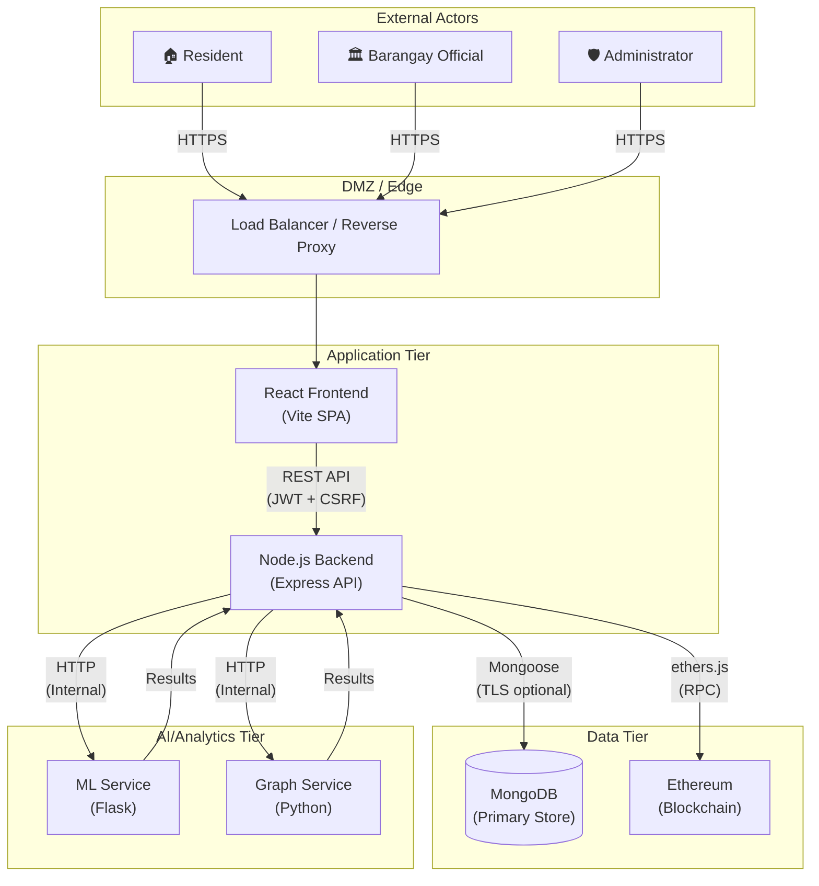
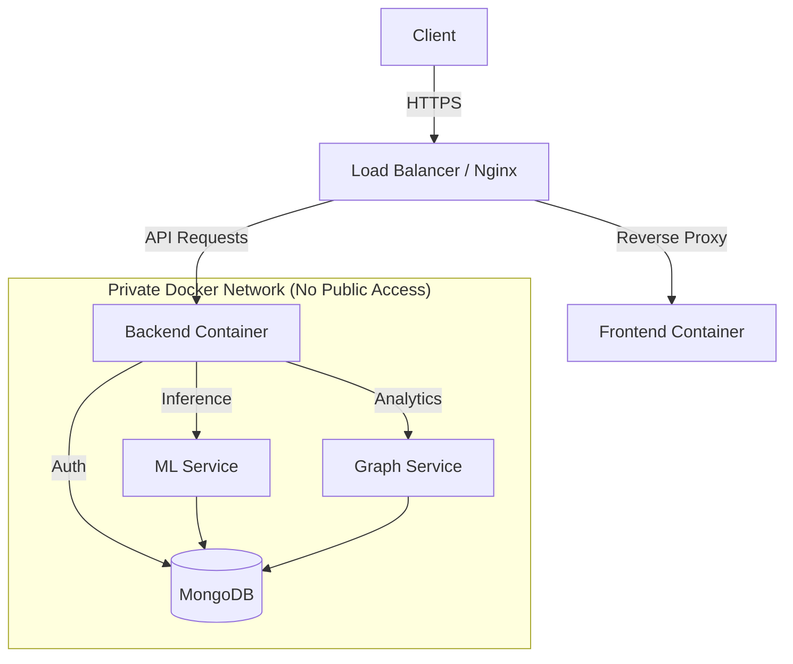

# 🛡️ ChainShield Consolidated Security Documentation

This document serves as the single source of truth for all security-related aspects of ChainShield, including architecture, threat modeling, hardening guidelines, administrative procedures, and production readiness.

## 📚 Table of Contents
1.  [System Overview & Architecture](#1-system-overview--architecture)
2.  [Security Controls & Implementation](#2-security-controls--implementation)
3.  [Threat Model & Analysis](#3-threat-model--analysis)
4.  [Admin Setup & Management](#4-admin-setup--management)
5.  [SMTP & Email Configuration](#5-smtp--email-configuration)
6.  [Hardening Guide](#6-hardening-guide)
7.  [Production Readiness Checklist](#7-production-readiness-checklist)

---

## 1. System Overview & Architecture

ChainShield is an AI-powered barangay transaction monitoring system with five services:
- **Frontend** (React/Vite) — User interface
- **Backend** (Node.js/Express) — API server, auth, business logic
- **MongoDB** — Primary database
- **ML Service** (Python/Flask) — Fraud detection models
- **Graph Service** (Python) — Network analysis
- **Blockchain** (Ethereum/Ganache) — Immutable audit trail

### Data Flow Diagram (DFD)



### Trust Boundaries

| Boundary | Components | Controls |
|---|---|---|
| **TB1**: Internet → DMZ | Users → Frontend | TLS, CORS, CSP headers |
| **TB2**: Frontend → Backend | SPA → API | JWT, CSRF, Rate Limiting |
| **TB3**: Backend → Database | API → MongoDB | Auth, TLS optional, RBAC |
| **TB4**: Backend → ML/Graph | API → Internal services | Docker network isolation |
| **TB5**: Backend → Blockchain | API → Ethereum RPC | Private key management |

---

## 2. Security Controls & Implementation

ChainShield implements defense-in-depth across six security domains:

### Authentication & Session Management

| Control | Implementation | Details |
|---|---|---|
| Password Hashing | bcrypt (12 rounds) | Pre-save hook in `User.js` |
| JWT Tokens | `jsonwebtoken` | 24h expiry, HS256 signing |
| 2FA (OTP) | Email OTP for all non-admin roles | CSPRNG via `crypto.randomInt()` |
| Token Blacklist | In-memory Set | Logout invalidates JWT immediately |
| Session Expiry | JWT exp claim | 24h maximum session lifetime |
| Idle Timeout | Frontend IdleTimer | Auto-logout after inactivity |

### Rate Limiting

| Limiter | Window | Max Requests | Target |
|---|---|---|---|
| `loginLimiter` | 15 min | 20 | `/auth/login` |
| `registrationLimiter` | 1 hour | 10 | `/auth/register` |
| `otpVerificationLimiter` | 10 min | 10 | OTP endpoints |
| `otpResendLimiter` | 1 hour | 10 | Resend endpoints |
| `apiLimiter` | 15 min | 5000 (errors only) | All `/api/*` |
| `strictLimiter` | 1 hour | 50 | Sensitive operations |

### Input Protection

| Layer | Technology | Coverage |
|---|---|---|
| NoSQL Injection | `express-mongo-sanitize` | Global middleware, strips `$` operators |
| XSS | `xss` library | Global body sanitization middleware |
| CSRF | `csurf` (double-submit cookie) | All mutating HTTP methods |
| Input Validation | `express-validator` | Auth routes, complaint routes |
| Content Security Policy | `helmet` | Script-src, style-src, img-src directives |
| File Upload | `multer` | Extension + MIME validation, 10MB limit |

### Access Control (RBAC)

**Roles**: `resident`, `barangay_official`, `analyst`, `investigator`, `administrator`

| Resource | Resident | Official | Analyst/Investigator | Admin |
|---|---|---|---|---|
| View transactions | ✅ (own) | ✅ | ✅ | ✅ |
| Submit complaints | ✅ | ✅ | ✅ | ✅ |
| Import CSV | ❌ | ✅ | ❌ | ✅ |
| View fraud cases | ❌ | ❌ | ✅ | ✅ |
| Manage users | ❌ | ❌ | ❌ | ✅ |
| View audit logs | ❌ | ❌ | ❌ | ✅ |

### Database Security

| Control | Implementation |
|---|---|
| Credentials | `.env` file (gitignored) |
| Authentication | MongoDB SCRAM via `docker-compose.yml` |
| Transport Encryption | TLS support via `MONGODB_TLS` env var |
| Encrypted Backups | `backup.sh` (AES-256-CBC + PBKDF2) |
| Mongoose ODM | Parameterized queries, schema validation |

### Audit Logging

All security-relevant events are logged to the `AuditLog` collection:

**Tracked Events**: `user_login`, `user_login_otp`, `user_register`, `user_verified`, `user_logout`, `login_failed`, `admin_invite`, `admin_update_user_role`, `admin_deactivate_user`, `admin_activate_user`, `admin_update_user`, `admin_create_user`, `admin_delete_user`, `feedback_submitted`, `feedback_flagged`, `model_retrained`

**Captured Metadata**: User ID, role, IP address, user agent, timestamps, suspicious flags

---

## 3. Threat Model & Analysis

### STRIDE Threat Analysis

#### Spoofing (Authentication)

| # | Threat | Impact | Likelihood | Mitigation | Status |
|---|---|---|---|---|---|
| S1 | Credential stuffing | HIGH | MEDIUM | Rate limiting (20 attempts/15min), account lockout | ✅ Implemented |
| S2 | JWT theft | HIGH | MEDIUM | Short expiry (24h), token blacklist on logout | ✅ Implemented |
| S3 | Session fixation | MEDIUM | LOW | JWT-based (no server sessions), token rotation on OTP verify | ✅ Mitigated |
| S4 | OTP brute force | HIGH | LOW | 10-attempt limit, 10-min expiry, rate limiting | ✅ Implemented |

#### Tampering (Integrity)

| # | Threat | Impact | Likelihood | Mitigation | Status |
|---|---|---|---|---|---|
| T1 | Request body tampering | HIGH | MEDIUM | CSRF protection (csurf double-submit), input validation | ✅ Implemented |
| T2 | NoSQL injection | CRITICAL | MEDIUM | express-mongo-sanitize, parameterized queries via Mongoose | ✅ Implemented |
| T3 | XSS payload injection | HIGH | MEDIUM | Global XSS sanitization middleware, Helmet CSP | ✅ Implemented |
| T4 | Transaction record tampering | CRITICAL | LOW | Blockchain hash verification | ✅ Implemented |

#### Repudiation (Non-repudiation)

| # | Threat | Impact | Likelihood | Mitigation | Status |
|---|---|---|---|---|---|
| R1 | User denies actions | MEDIUM | MEDIUM | Audit logging (AuditLog model) with IP, user agent | ✅ Implemented |
| R2 | Admin action denial | HIGH | LOW | All admin actions audit-logged with user context | ✅ Implemented |
| R3 | Transaction record denial | CRITICAL | LOW | Blockchain immutability (on-chain hashes) | ✅ Implemented |

#### Information Disclosure

| # | Threat | Impact | Likelihood | Mitigation | Status |
|---|---|---|---|---|---|
| I1 | User enumeration via registration | MEDIUM | HIGH | Generic error messages | ✅ Fixed |
| I2 | Error stack traces in production | MEDIUM | MEDIUM | Environment-conditional error details | ✅ Implemented |
| I3 | Sensitive field exposure in API | MEDIUM | MEDIUM | `.select('-password -otp -otpExpires')` on queries | ✅ Implemented |
| I4 | OTP leak in production logs | HIGH | LOW | Environment-conditional OTP console logging | ✅ Fixed |

#### Denial of Service

| # | Threat | Impact | Likelihood | Mitigation | Status |
|---|---|---|---|---|---|
| D1 | API flood | HIGH | HIGH | 6-tier rate limiting (API, login, OTP, registration, strict) | ✅ Implemented |
| D2 | Large file upload | MEDIUM | MEDIUM | 10MB file size limit, MIME validation | ✅ Implemented |
| D3 | Request body size | LOW | MEDIUM | `express.json({ limit: '10mb' })` | ✅ Implemented |

#### Elevation of Privilege

| # | Threat | Impact | Likelihood | Mitigation | Status |
|---|---|---|---|---|---|
| E1 | Role escalation via API | CRITICAL | MEDIUM | RBAC middleware, admin-only role changes, self-demotion prevention | ✅ Implemented |
| E2 | Admin registration via public endpoint | CRITICAL | LOW | Blocked in registration controller | ✅ Implemented |
| E3 | Mass assignment | HIGH | MEDIUM | Explicit field picking in controllers | ✅ Implemented |

### OWASP Top 10 (2021) Mapping

| # | Category | Risk Level | ChainShield Controls | Score |
|---|---|---|---|---|
| A01 | Broken Access Control | LOW | RBAC middleware, permission matrix, route-level guards | 4/5 |
| A02 | Cryptographic Failures | LOW | bcrypt(12), JWT with secret, CSPRNG OTP, blockchain hashing | 4/5 |
| A03 | Injection | LOW | Mongoose ODM, express-mongo-sanitize, express-validator, XSS middleware | 5/5 |
| A04 | Insecure Design | MEDIUM | Threat model documented, security-first architecture | 4/5 |
| A05 | Security Misconfiguration | LOW | Helmet, .env-based config, CSP headers, CORS | 4/5 |
| A06 | Vulnerable Components | MEDIUM | Dependencies pinned in package-lock.json | 3/5 |
| A07 | Auth Failures | LOW | 2FA for all roles, rate limiting, token blacklist | 4/5 |
| A08 | Data Integrity Failures | LOW | Blockchain verification, CSRF protection, input validation | 4/5 |
| A09 | Logging & Monitoring | LOW | AuditLog model, suspicious activity tracking, IP/UA logging | 4/5 |
| A10 | SSRF | LOW | Internal services on Docker network, no user-controlled URLs | 4/5 |

---

## 4. Admin Setup & Management

### Creating an Administrator Account

**IMPORTANT**: For security reasons, administrator accounts cannot be created through the public registration page. Admin accounts must be created directly in the database using the provided script or manually via MongoDB shell.

#### Method 1: Using the Setup Script (Recommended)

We have provided a script to easily create a default administrator account.

1. Navigate to the backend directory:
   ```bash
   cd backend
   ```

2. Run the creation script:
   ```bash
   node create-admin.js
   ```

3. The script will create an admin user with the following credentials:
   - **Email**: `admin@chainshield.local`
   - **Password**: (Generated randomly, displayed on screen)

   > **⚠️ IMPORTANT**: Log in immediately and change this password!

#### Method 2: Manual Creation via MongoDB Shell

If you prefer to create an admin manually:

1. Connect to your MongoDB instance:
   ```bash
   docker exec -it chainshield-mongodb mongosh
   # OR
   mongosh
   ```

2. Switch to the database:
   ```javascript
   use chainshield
   ```

3. Insert the admin user (password needs to be hashed using bcrypt):
   ```javascript
   // Run this in Node.js REPL to generate hash:
   // const bcrypt = require('bcryptjs'); console.log(bcrypt.hashSync('YourSecurePassword123', 10));

   db.users.insertOne({
     firstName: "System",
     lastName: "Administrator",
     email: "admin@chainshield.local",
     password: "$2a$10$YourHashedPasswordHere", 
     role: "administrator",
     position: "System Administrator",
     isVerified: true,
     isActive: true,
     mustChangePassword: true,
     mustSetup2FA: true,
     createdAt: new Date(),
     updatedAt: new Date()
   })
   ```

### Admin Access & Security

- **URL**: `/login`
- **Role**: `administrator`

#### Best Practices
- **Never** leave the default password unchanged.
- **Do not** create admin accounts for users who do not need full system access.
- **Audit Logs**: All admin actions are logged.
- **Hardware Security**: Use dedicated devices for admin access where possible.
- **Network Security**: Use VPN or whitelisted IPs for database access.

#### Resetting Admin Credentials

If you lose access:
1. Run `node reset-admin.js` in the `backend/` directory.
2. This will:
   - Generate a new temporary password.
   - Clear all "Trusted Devices".
   - Clear any stuck 2FA/OTP states.
   - Force password change and 2FA setup on next login.

---

## 5. SMTP & Email Configuration

ChainShield uses **Nodemailer** for sending OTP verification emails and admin invitations.

### Quick Start

Your `.env` file must be configured with valid SMTP credentials for production use. In development, you may disable SMTP to force console logging of OTPs, but this is **disabled by default in secure mode**.

### Setup Options

#### Option 1: Gmail (Recommended for Personal Use)
1. **Enable 2-Factor Authentication** on your Google account.
2. **Generate App Password** at https://myaccount.google.com/apppasswords.
3. **Update `.env`**:
   ```bash
   SMTP_HOST=smtp.gmail.com
   SMTP_PORT=587
   SMTP_SECURE=false
   SMTP_USER=your-email@gmail.com
   SMTP_PASS=abcd efgh ijkl mnop  # Your app password
   ```

#### Option 2: SendGrid (Recommended for Production)
1. **Sign up** at https://sendgrid.com.
2. **Create API Key** with "Mail Send" permissions.
3. **Verify sender identity**.
4. **Update `.env`**:
   ```bash
   SMTP_HOST=smtp.sendgrid.net
   SMTP_PORT=587
   SMTP_SECURE=false
   SMTP_USER=apikey
   SMTP_PASS=SG.your-sendgrid-api-key-here
   ```

### Environment Variables Reference

| Variable | Required | Description | Example |
|----------|----------|-------------|---------|
| `SMTP_HOST` | Yes | SMTP server hostname | `smtp.gmail.com` |
| `SMTP_PORT` | Yes | SMTP server port | `587` |
| `SMTP_SECURE` | No | Use TLS (true/false) | `false` |
| `SMTP_USER` | Yes | SMTP username | `user@gmail.com` |
| `SMTP_PASS` | Yes | SMTP password | `app-password` |
| `EMAIL_FROM` | Yes | Sender email address | `noreply@domain.com` |

---

## 6. Hardening Guide

This section provides a technical roadmap to harden ChainShield for production deployment.

### 🔴 Phase 1: Critical Fixes (Immediate Action Required)

1. **Secure Admin Authentication**: Ensure `authController.js` enforces OTP for all admin logins. (Completed)
2. **Secure Random Number Generation**: Use `crypto.randomInt()` instead of `Math.random()` for OTPs. (Completed)
3. **Container Privilege Escalation**: Run containers as non-root user (`USER node` in Dockerfile).
4. **Network Exposure**: Do not expose internal service ports (5001, 5002) to the host in `docker-compose.yml`.

### 🟠 Phase 2: High Priority Improvements

1. **Robust File Handling**: Implement a robust retry mechanism or cron job to clean `uploads/` directory.
2. **Generic Error Messages**: Standardize responses to "Invalid credentials" to prevent enumeration. (Completed)
3. **Database Hardening**: Enable MongoDB authentication and use TLS. (Completed)

### 🟡 Phase 3: Medium Priority & Hygiene

1. **Strict Transport Security (HSTS)**: Configure `helmet` to enforce HSTS.
2. **Rate Limiting Tuning**: Tune `express-rate-limit` for stricter limits on `/auth/*` endpoints.
3. **Dependency Audit**: Run `npm audit` regularly.

### Recommended Secure Architecture



---

## 7. Production Readiness Checklist

### 🔐 Identity & Access Management (IAM)
- [ ] **MFA Enforced:** Admin and sensitive roles require OTP.
- [ ] **Strong Passwords:** Password policy Enforced (Length > 12, complexity).
- [ ] **Session Management:** Secure, HTTPOnly, SameSite cookies used.
- [ ] **Token Expiry:** JWT tokens expire < 24h.
- [ ] **Generic Errors:** Login endpoints do not reveal user existence.

### 🛡️ Application Security
- [ ] **Input Validation:** All inputs vetted (Joi/express-validator).
- [ ] **Sanitization:** XSS filters active (xss/dompurify).
- [ ] **Injection Prevention:** NoSQL/SQL injection protections verified.
- [ ] **Secure Headers:** Helmet.js enabled with strict CSP.
- [ ] **Rate Limiting:** Enabled on all API routes, stricter on Auth.
- [ ] **Dependency Audit:** `npm audit` returns zero critical/high issues.

### 🏗 Infrastructure & Docker
- [ ] **Non-Root Containers:** Services run as `node` or non-privileged user.
- [ ] **Least Privilege:** Database users have restricted permissions.
- [ ] **Network Isolation:** Only Load Balancer ports (80/443) exposed.
- [ ] **Secrets Management:** No `.env` files in images. Secrets passed via env vars/Vault.
- [ ] **Logging:** Personally Identifiable Information (PII) masked in logs.

### 📀 Data Security
- [ ] **Encryption at Rest:** Database volume encryption enabled.
- [ ] **Encryption in Transit:** TLS 1.2+ for all connections.
- [ ] **Backups:** Automated, encrypted backups configured.

### 🚨 Monitoring & Response
- [ ] **Audit Logs:** Centralized logging enabled (ELK/Splunk equivalent).
- [ ] **Alerting:** Alerts set for failed logins, high-value transactions.
- [ ] **Incident Plan:** "In case of breach" document exists.

---

*Last Updated: 2026-02-17*
