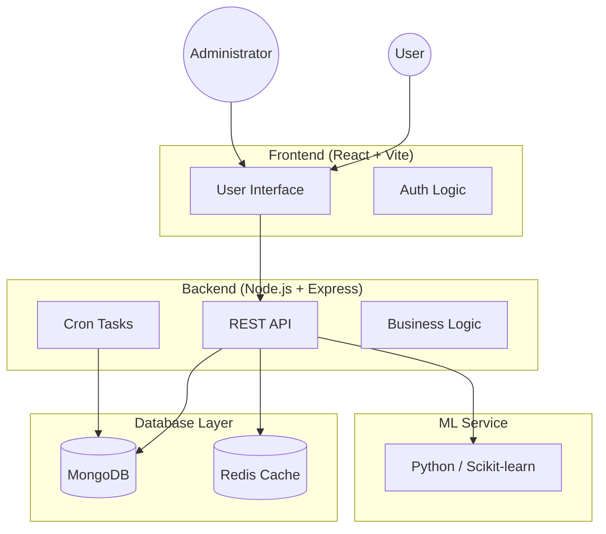

# System Architecture

## 1. Overview
ChainShield is a multi-tier web application designed for transaction auditing and fraud detection.

## 2. Component Breakdown
- **Frontend:** Single Page Application (SPA) built with React. Handles routing, state management, and interaction with the backend API.
- **Backend:** Node.js Express server. Provides secured REST endpoints, handles authentication (JWT + OAuth), and manages persistent data.
- **ML Service:** Internal service specifically for fraud risk scoring and transaction analysis.
- **Database:** MongoDB for persistent storage of users, transactions, and audit logs.

## 3. Security Architecture
- **Perimeter Defense:** Helmet headers, CORS policies, and rate limiting.
- **In-Transit Security:** TLS/SSL encryption for all client-server and server-DB communication.
- **Authentication:** Dual-layer auth (Password/OAuth + TOTP 2FA).
- **Integrity Layer:** Cryptographically hashed audit logs to detect tampering.
